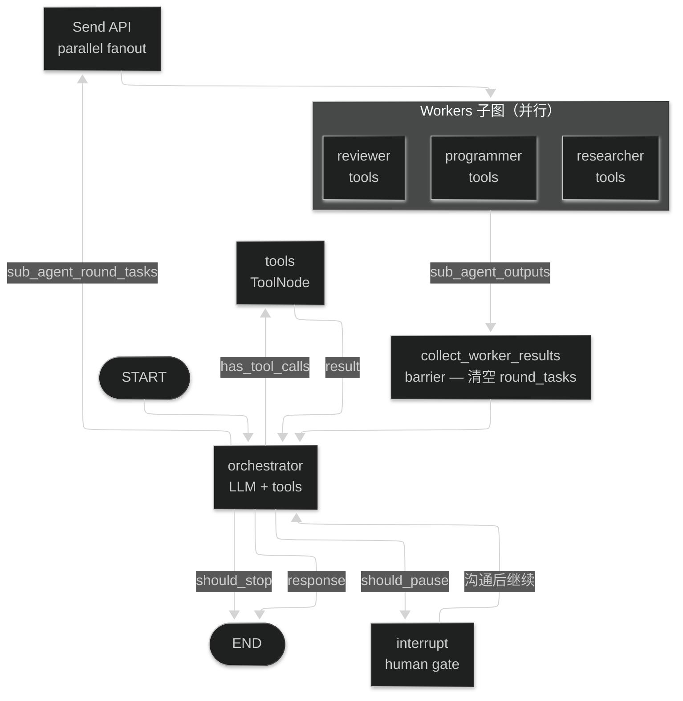

# Orchestration Architecture v0.0.2

```mermaid
---
config:
  theme: dark
  look: neo
  layout: elk
---
graph TD
    Start([START]) --> Orchestrator

    Orchestrator["orchestrator<br/>LLM + tools"]

    Orchestrator -->|"should_stop"| End([END])
    Orchestrator -->|"should_pause"| Interrupt["interrupt<br/>human gate"]
    Orchestrator -->|"response"| End
    Orchestrator -->|"has_tool_calls"| Tools["tools<br/>ToolNode"]
    Orchestrator -->|"sub_agent_round_tasks"| Send["Send API<br/>parallel fanout"]

    Tools -->|result| Orchestrator
    Interrupt -->|"沟通后继续"| Orchestrator

    subgraph Workers["Workers 子图（并行）"]
        PG["programmer<br/>tools"]
        RS["researcher<br/>tools"]
        RV["reviewer<br/>tools"]
    end

    Send --> Workers
    Workers -->|sub_agent_outputs| Collect["collect_worker_results<br/>barrier — 清空 round_tasks"]
    Collect --> Orchestrator
```
