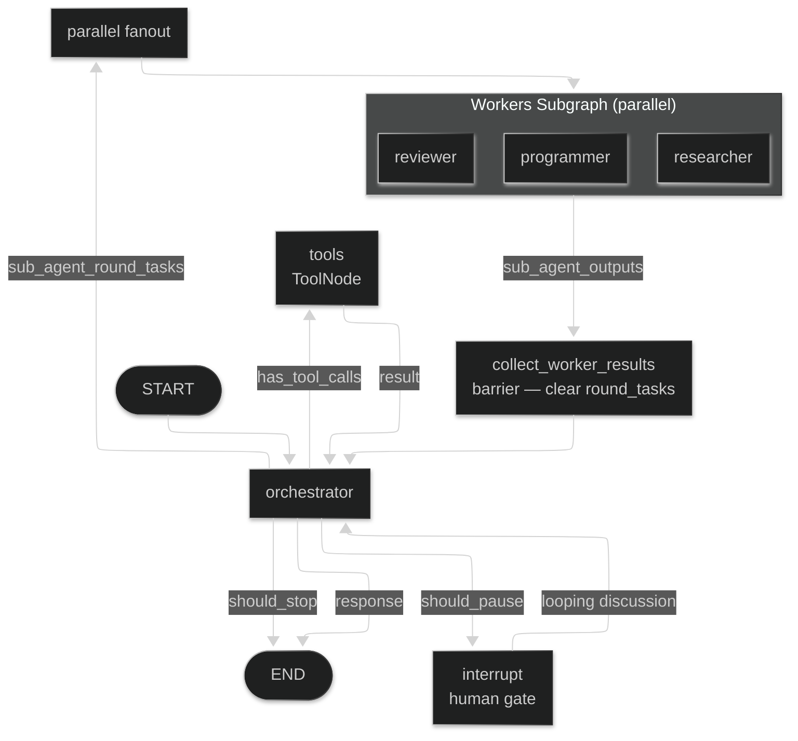
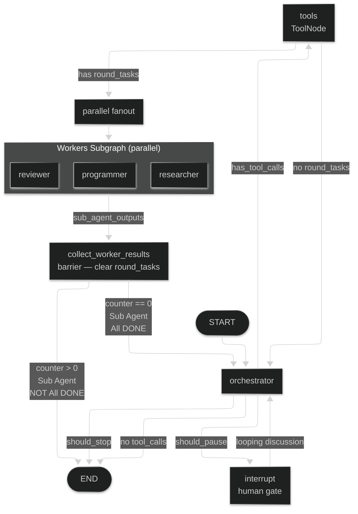
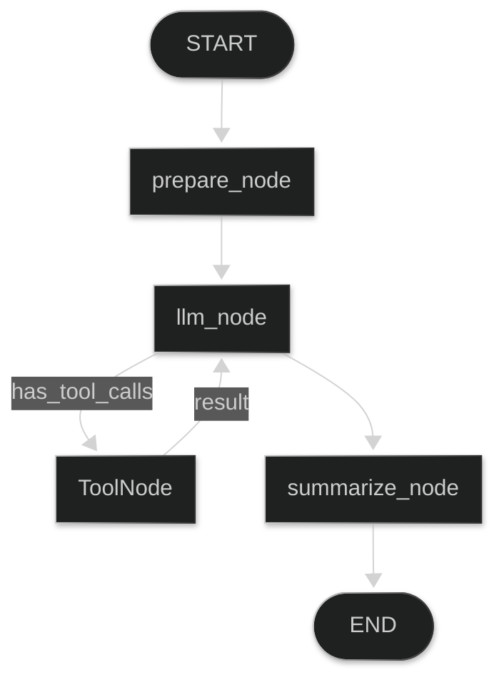

# Orchestration Architecture v0.0.2

## 第一版 主图

```mermaid
---
config:
  theme: dark
  look: neo
  layout: elk
---
graph TD
    Start([START]) --> Orchestrator

    Orchestrator["orchestrator<br/>"]

    Orchestrator -->|"should_stop"| End([END])
    Orchestrator -->|"should_pause"| Interrupt["interrupt<br/>human gate"]
    Orchestrator -->|"response"| End
    Orchestrator -->|"has_tool_calls"| Tools["tools<br/>ToolNode"]
    Orchestrator -->|"sub_agent_round_tasks"| Send["parallel fanout"]

    Tools -->|result| Orchestrator
    Interrupt -->|"looping discussion"| Orchestrator

    subgraph Workers["Workers Subgraph (parallel)"]
        PG["programmer"]
        RS["researcher"]
        RV["reviewer"]
    end

    Send --> Workers
    Workers -->|sub_agent_outputs| Collect["collect_worker_results<br/>barrier — clear round_tasks"]
    Collect --> Orchestrator

    style Tools stroke-width:1px
```

## 第二版 主图

```mermaid
---
config:
  theme: dark
  look: neo
  layout: elk
---
graph TD
    Start([START]) --> Orchestrator

    Orchestrator["orchestrator"]

    Orchestrator -->|"should_stop"| End([END])
    Orchestrator -->|"should_pause"| Interrupt["interrupt<br/>human gate"]
    Orchestrator -->|"no tool_calls"| End
    Orchestrator -->|"has_tool_calls"| Tools["tools<br/>ToolNode"]

    Tools -->|"no round_tasks"| Orchestrator
    Tools -->|"has round_tasks"| Send["parallel fanout"]

	Interrupt -->|"looping discussion"| Orchestrator

    subgraph Workers["Workers Subgraph (parallel)"]
        PG["programmer"]
        RS["researcher"]
        RV["reviewer"]
    end

    Send --> Workers
	Workers -->|sub_agent_outputs| Collect["collect_worker_results<br/>barrier — clear round_tasks"]
    Collect -->|"counter > 0<br/>Sub Agent<br/>NOT All DONE"| End
    Collect -->|"counter == 0<br/>Sub Agent<br/>All DONE"| Orchestrator
```

## 第一版 子图

```mermaid
---
config:
  theme: dark
  look: neo
---
graph TD
    Start([START]) --> prepare_node

	prepare_node --> llm_node["llm_node"]
	llm_node -->|"has_tool_calls"| Tools["ToolNode"]
	Tools["ToolNode"] -->|"result"| llm_node
	llm_node --> summarize_node

	summarize_node --> END([END])

```
